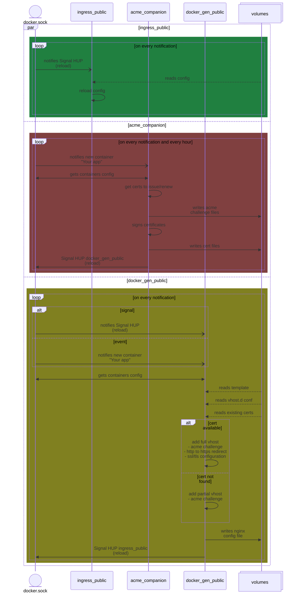
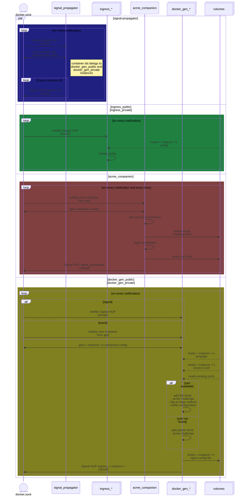

# How it works

Ingress instances mounts `html`, `certs`, `conf.d` and `vhost.d` volumes and `conf` files in read-only mode.
Docker-gen instances mounts `certs` and `vhost.d` volumes and `templates` file in read-only mode, and `conf.d` volume in read-write mode.
Acme-companion instances mount `acme`, `html` and `certs` volume in read-write mode.

# Single Ingress instance

# Dual Ingress instances

